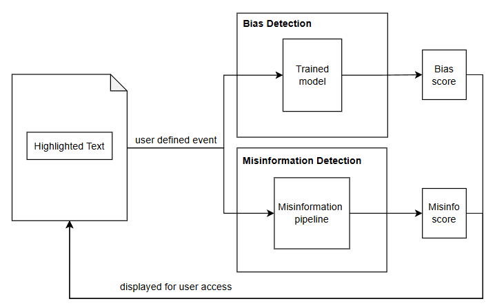
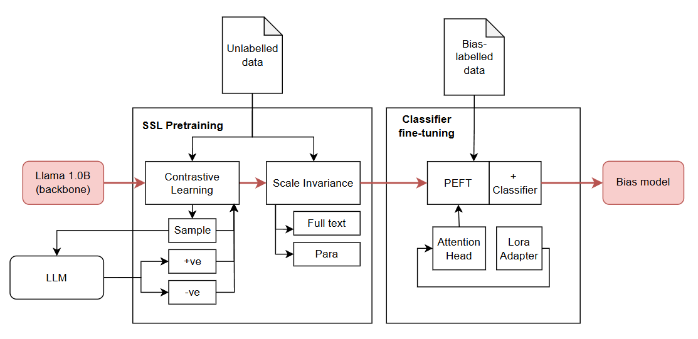

# NTU-DLWeek2025 - High-Lie-ter 📰

## Overview
In today's digital landscape, misinformation and bias pose significant threats to media integrity. Our goal during this hackathon was to **develop AI-powered solutions that uphold media integrity and foster trust in digital content.**

To tackle this, Team Perchance built **High-Lie-ter**, a web extension that helps users assess online content for bias and misinformation. Our approach includes leveraging **Self-Supervised Learning (SSL)** to enable our model to develop an inherent understanding of multiple dimensions in text—allowing for more adaptable and reliable analysis across different contexts.

---

## How It Works ⚙️
High-Lie-ter provides users with a way to analyze selected portions of web content through a two-step AI pipeline:

1. **Bias Classification:**
   - Pre-trained a **LLaMA 1.0B** backbone using **contrastive learning** by generating augmented texts (more/less biased versions) via an LLM. This ensures the model understands bias without inheriting another model’s potential biases.
   - Incorporated **scale invariance**, training on words, sentences, and paragraphs separately to enhance multi-scale bias detection.
   - Fine-tuned using **PEFT and LoRA adapters** on pseudo-labeled datasets to refine predictions.
   - Outputs a confidence score on how biased the text may be.

2. **Misinformation Detection:**
   - Extracts **keywords and phrases** from the text.
   - Runs a **filtered Google Search API** query to find related articles.
   - Embeds retrieved articles and compares them against the original content using **FAISS** to determine a misinformation score.

The extension then **highlights** the analyzed text in different colors to indicate levels of bias and misinformation.

---

## Tech Stack 🔧

### Frontend:
- **HTML, JavaScript, CSS** (Web Extension UI)

### Backend:
- **Bias Classification Model** (Self-Supervised Learning + PEFT Fine-tuning)
- **Misinformation Pipeline** (Keyword Extraction + Google Search API + FAISS Vector Comparison)

### Storage:
- **FAISS Vector Store** (For embedding similarity comparison)

### APIs:
- **Google Search API** (For retrieving comparative articles)

---

## Architecture

**Slides link:** https://docs.google.com/presentation/d/17OnTREfq-5hSUgQMGFLgPFfXZcpf0sJpVGRPEqv61yk/edit#slide=id.g3326928b97b_5_105
