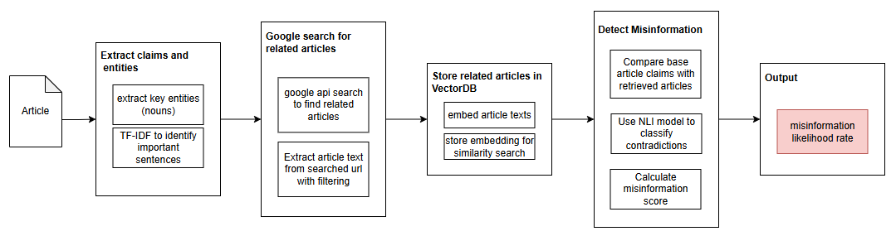
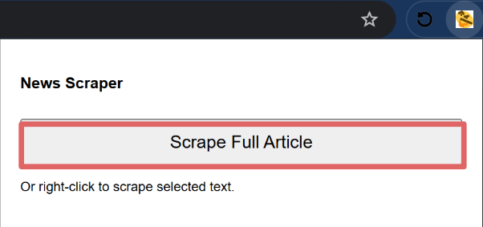
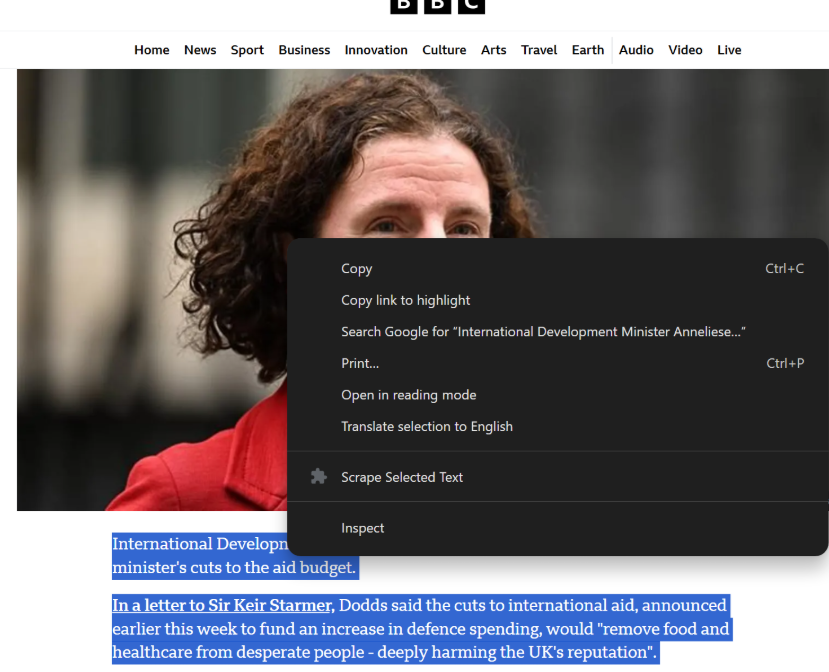
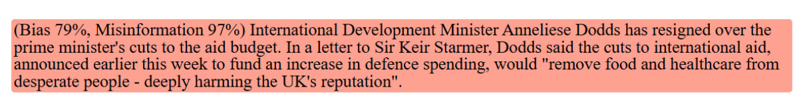

# NTU-DLWeek2025 - High-Lie-ter 🖍️

## Overview 📰
In today's digital landscape, misinformation and bias pose significant threats to media integrity. Our goal during the NTU Deep Learning Week 2025 Hackathon was to **develop AI-powered solutions that uphold media integrity and foster trust in digital content.**

To tackle this, Team Perchance built **High-Lie-ter**, a web extension that helps users assess online content for bias and misinformation. 

Our approach to applying **Deep Learning** includes leveraging **Self-Supervised Learning (SSL)** to enable our model to develop an inherent understanding of multiple dimensions in text—allowing for more adaptable and reliable analysis across different contexts. We also adapted **Parameter Efficient Fine Tuning via LoRA Adapters** (Additive fine tuning) to fine tune our pre-trained model without affecting its previous understanding of texts.


## How It Works ⚙️
High-Lie-ter provides users with a way to analyze selected portions of web content through a three-step pipeline:

1. **Bias Classification:** 💬
   - Pre-trained a **LLaMA 1.0B** backbone using **contrastive learning** by generating augmented texts (more/less biased versions) via an LLM. This ensures the model understands bias without inheriting another model’s potential biases.
   - Incorporated **scale invariance**, training on words, sentences, and paragraphs separately to enhance multi-scale bias detection.
   - Fine-tuned using **PEFT and LoRA adapters** on pseudo-labeled datasets to refine predictions.
   - Outputs a confidence score on how biased the text may be.

2. **Misinformation Detection:** ❗️
   - Extracts **keywords and phrases** from the text.
   - Runs a **filtered Google Search API** query to find related articles.
   - Embeds retrieved articles and compares them against the original content using **FAISS** to determine a misinformation score.

3. **User accessibility** 👤
   - The extension then **highlights** the analyzed text or article in **different colors corresponing** to scores given.
   - Lower level details are also provided (**bias and misinformation scores**) for user reference.

## **Potential Future Enhancements include** 🚀

- 🔎 **Multi-Modal** system to take in visual data for **deepfake detection**
- 📝 **Fine-tuning with Ray** through hyperparameter tuning
- 📈 **Improved UI extention** to aid accessibility by modelling Grammarly's web extention
- 🏆 **Objective human labels** of biased and non-biased texts

### To further understand our project implementation and motivation, you can refer to our [google slides](https://docs.google.com/presentation/d/17OnTREfq-5hSUgQMGFLgPFfXZcpf0sJpVGRPEqv61yk/edit?usp=sharing) or  view the UI implementation in our [video](https://www.youtube.com/watch?v=dS-1T7bmxRo).


---
---

## Tech Stack 🔧

Section | Stack
------- | -----
Frontend (Web Extension UI) | HTML, JavaScript, CSS
Bias Classification Model | Self-Supervised Pre-training, PEFT Fine-tuning (LoRA adapters)
Misinformation Pipeline | Keyword Extraction, Google Search API, Vector Store, FAISS


## **Deployment Instructions**
To set up and run High-Lie-Ter, follow these steps:

### **1. Clone the Repository**
```bash
git clone https://github.com/cvu-opensource/NTU-DLWeek2025.git
cd NTU-DLWeek2025
```

### **2. Setup backend virtual environments**
Ensure you have Python installed, then:
```bash
cd model_scripts
python -m venv venv
venv\Scripts\activate  # On Windows
source venv/bin/activate  # On macOS/Linux
pip install -r requirements.txt
run_bias_server.bat  # Start the FastAPI backend
```
```bash
cd misinformation_scripts
python -m venv venv
venv\Scripts\activate  # On Windows
source venv/bin/activate  # On macOS/Linux
pip install -r requirements.txt
run_misinformation_server.bat  # Start the FastAPI backend
```

### **3. Frontend Setup**
Ensure Node.js and npm are installed, then:
```bash
cd extentiontools
uvicorn server:app --reload --port 7002
```

---
---

## Visualisations


### Bias Detection Model


### Misinformation Detection


### UI implementation






<br>

---
---

### Contributors

| Name            | Tasks                          | GitHub Profile                        | LinkedIn Profile                       |
|-----------------|-------------------------------|---------------------------------------|----------------------------------------|
| **Gerard Lum**   | Fine-tuning, APIs      | [https://github.com/gerardlke](https://github.com/gerardlke) | [https://www.linkedin.com/in/gerardlumkaien/](https://www.linkedin.com/in/gerardlumkaien/) |
| **Benjamin Goh** | Pre-training, ML expert   | [https://github.com/checkpoint214159](https://github.com/checkpoint214159) | [https://www.linkedin.com/in/benjamin-goh-45a0a7307/](https://www.linkedin.com/in/benjamin-goh-45a0a7307/) |
| **Yeo You Ming**   | Web extention, UI, Web scraper  | [https://github.com/Forfeit-15](https://github.com/Forfeit-15) | [https://www.linkedin.com/in/yeo-you-ming-5b10852aa/](https://www.linkedin.com/in/yeo-you-ming-5b10852aa/) |
| **Skyler Lee**    | Misinformation detection | [https://github.com/N1sh0](https://github.com/N1sh0) | [https://www.linkedin.com/in/skyler-lee-zhan-bin/](https://www.linkedin.com/in/skyler-lee-zhan-bin/) |